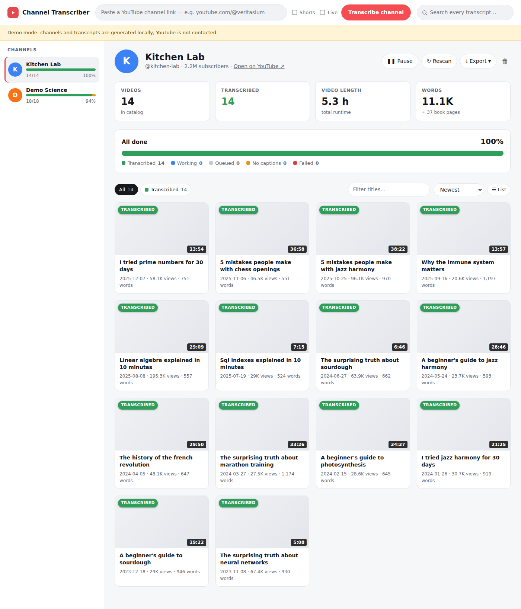
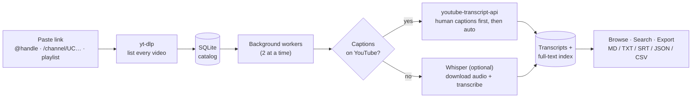
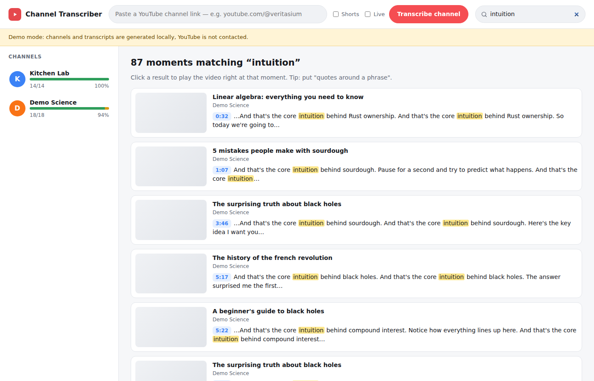
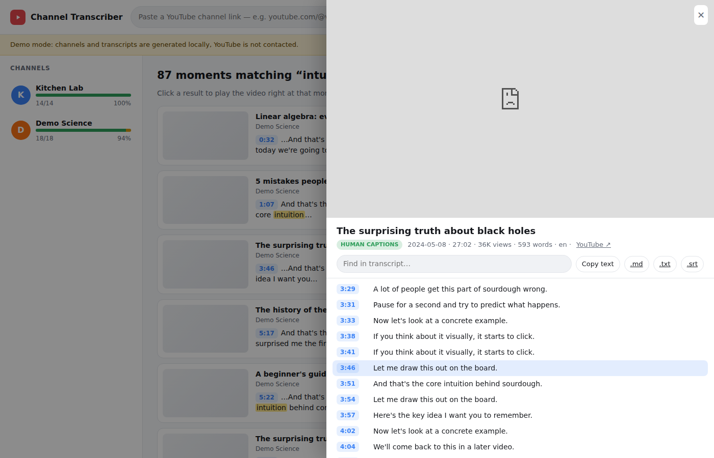

# Channel Transcriber

Paste a YouTube channel link. The app finds every video on the channel, catalogs it (title, date, length, views), and fetches each transcript in the background. You can then read, search and export everything.



## How it works



| Status | Meaning |
|---|---|
| 🟢 **Transcribed** | Transcript saved and searchable |
| 🔵 **Working** | Being fetched right now |
| ⚪ **Queued** | Waiting its turn |
| 🟡 **No captions** | YouTube has no captions for it (turn on Whisper to transcribe these) |
| 🔴 **Failed** | Something went wrong; use **Retry failed** |

## Use it on your phone (host it online)

[](https://render.com/deploy?repo=https://github.com/KLinares99/YT-Transcripts)

1. Tap the button and sign in to Render with GitHub.
2. When asked for `YTT_PASSWORD`, type a password. Leave `YTT_PROXY` blank.
3. Tap **Apply**. After about 5 minutes Render shows your link (`https://yt-transcripts-xxxx.onrender.com`).
4. Open the link on your phone and enter your password (the username can be anything). Tip: use **Add to Home Screen** to get an app icon.

Costs about $7/month (Render Starter plus a 1 GB disk, so your transcripts survive restarts).

## Run it on a Mac (free)

1. Install Python from https://www.python.org/downloads/ (if you don't have 3.10 or newer).
2. On GitHub, tap **Code → Download ZIP**, then double-click the ZIP in Downloads to unzip it.
3. Open **Terminal** and run:
   ```bash
   cd ~/Downloads/YT-Transcripts-master
   bash run.sh
   ```
4. Your browser opens the app. Keep the Terminal window open while you use it. Next time, only step 3 is needed.

## Run it on a computer

**Option A: script (Python 3.10+)**

```bash
./run.sh            # then open http://localhost:8000
```

**Option B: Docker**

```bash
docker build -t yt-transcripts .
docker run -p 8000:8000 -v "$PWD/data:/data" yt-transcripts
```

**Try the UI without contacting YouTube** (generates fake channels):

```bash
YTT_DEMO=1 ./run.sh
```

## Features

- **Any link format:** `@handle`, `youtube.com/@handle/videos`, `/channel/UC…`, `/c/…`, `/user/…`, or a playlist URL. You can include Shorts and Live streams.
- **Resumable:** progress is stored in SQLite (`data/transcripts.db`), so after a restart it carries on where it left off. **Rescan** adds new uploads. Videos already done are never fetched again, even if they appear in more than one channel or playlist.
- **Search across all transcripts:** each hit links to the exact timestamp. Use `"quotes"` for phrases.
- **Transcript viewer:** an embedded player sits beside the transcript. Click any line to jump to it, and the current line highlights as the video plays.
- **Exports:**
  - per channel: ZIP (Markdown, TXT and SRT for each video, plus `catalog.csv`), full JSON, or the catalog CSV
  - per video: `.md`, `.txt` or `.srt`




## Settings (environment variables)

| Variable | Default | What it does |
|---|---|---|
| `YTT_WORKERS` | `2` | Videos fetched in parallel |
| `YTT_REQUEST_DELAY` | `1.0` | Seconds each worker waits between videos |
| `YTT_LANGUAGES` | `en,en-US,en-GB` | Preferred caption languages (otherwise the best available language is used) |
| `YTT_FETCH_METADATA` | `1` | Also fetch upload date and description for each video (one extra request per video) |
| `YTT_WHISPER` | `0` | Transcribe videos that have no captions locally. Needs `pip install faster-whisper` and ffmpeg |
| `YTT_WHISPER_MODEL` | `base` | Whisper model size (`tiny`, `base`, `small`, `medium`, `large-v3`) |
| `YTT_PROXY` | – | HTTP(S) proxy for all YouTube requests |
| `YTT_DATA_DIR` | `./data` | Where the database lives |
| `YTT_PASSWORD` | – | Require a password to open the app (recommended when hosted) |
| `YTT_DEMO` | `0` | Fake data mode |

## Good to know

- **Rate limits.** If you fetch a lot of transcripts quickly, YouTube may temporarily block your IP, and blocks are more likely from cloud servers. When that happens, the app shows a banner, pauses for 10 minutes, and then resumes on its own. For very large channels, keep `YTT_WORKERS` low, or set `YTT_PROXY` to a residential proxy.
- **Scale.** Captions take about 1–2 seconds per video. A 500-video channel finishes in roughly 10–20 minutes. Whisper is much slower: about real-time on a CPU, so use a GPU or a small model for big backlogs.
- Respect creators' rights and YouTube's Terms of Service when you use transcripts.

## Development

```bash
pip install -r requirements.txt pytest httpx
python -m pytest
```

Code layout: `app/youtube.py` (YouTube access), `app/worker.py` (background jobs), `app/db.py` (storage and search), `app/main.py` (API and exports), `app/static/` (UI).
